# CrackMe challenges

Password to unzip the file: crackinglessons.com

## CrackMe #1

[https://crackinglessons.com/crackme1/](https://crackinglessons.com/crackme1/)

A gui-based crackme written in Visual Studio 2017 win32 API. Objectives:

1. Find the serial key and enter in the textbox
2. Patch the file to always show the Congrats message when button Check is clicked

[crackMe1.zip](crackMe1.zip)

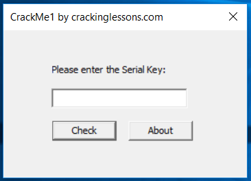

## CrackMe #2

[https://crackinglessons.com/crackme-2/](https://crackinglessons.com/crackme-2/)

Another gui-based crackme written in visual studio 2017 win32 api. Objectives:

[crackMe2.zip](crackMe2.zip)

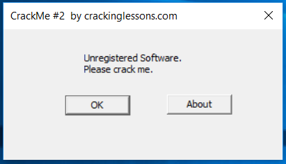

## CrackMe #3

[https://crackinglessons.com/crackme-3/](https://crackinglessons.com/crackme-3/)

Another gui-based crackme written in visual studio 2017 win32 api.

Objectives:

1. Remove the 2 nag screens – one at startup and one at close of program.
2. In the About screen – change status to Registered.

[crackMe3.zip](crackMe3.zip)

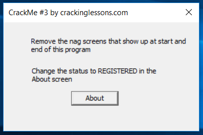

## CrackMe #4

[https://crackinglessons.com/crackme-4/](https://crackinglessons.com/crackme-4/)

A gui-based crackme written in visual studio 2017 win32 api, simulating a 30-day trial period software.

Objectives:

1. Crack it 4to extend beyond 30 days
2. In the About screen – also extend it to beyond 30 days

[crackMe4.zip](crackMe4.zip)

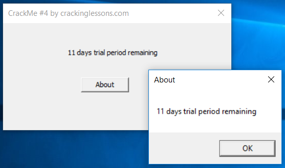

## CrackMe #5

[https://crackinglessons.com/crackme-5/](https://crackinglessons.com/crackme-5/)

A gui-based crackme written in visual studio 2017 win32 api, which creates a serial key based on user name.

Objectives:

1. Enter your first name.
2. Crack the software to find a valid serial key for your firstname

[crackMe5.zip](crackMe5.zip)

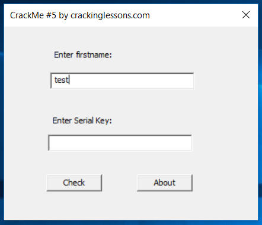

## #6 Target by TDC

[https://crackinglessons.com/6-target-by-tdc/](https://crackinglessons.com/6-target-by-tdc/)

This crackme is written by TDC and is an excellent Remove the Nag challenge.

Objectives:

1. Remove the starting Nag Screen
2. When the button Re-Check is clicked, a pop-up messagebox appears and you should set it to say "Thank you for registering this software"
3. Set the Status box text to: "Clean crack! Good Job!"

[target.zip](target.zip)

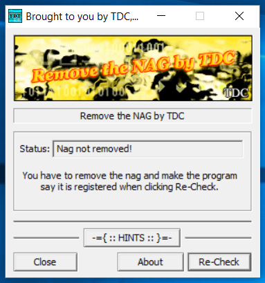

## CrackMe #7

[https://crackinglessons.com/crackme-7/](https://crackinglessons.com/crackme-7/)

This CrackMe teaches a specific method of cracking which is to trace the eax value and patch it.

[crackMe7.zip](crackMe7.zip)

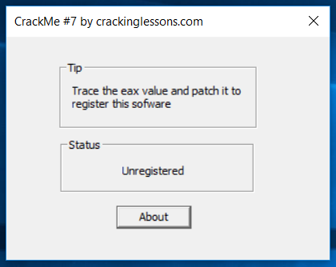

## CrackMe #8

[https://crackinglessons.com/crackme-8/](https://crackinglessons.com/crackme-8/)

This crackme is for learning how to put hardware breakpoints on memory addresses and then patch it to register the program.

[crackMe8.zip](crackMe8.zip)

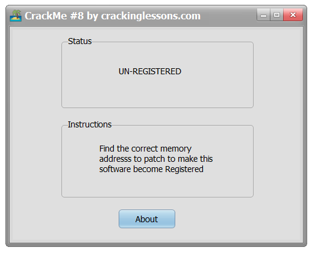

## CrackMe #9

[https://crackinglessons.com/crackme-9/](https://crackinglessons.com/crackme-9/)

To practice patching memory directly.

Objectives:

1. Find the correct serial key
2. Change it to a different key of your choice

[crackMe9.zip](crackMe9.zip)

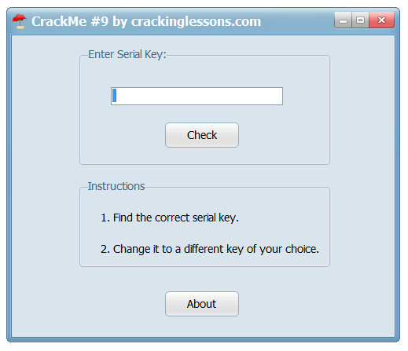

## #10 ReverseMe2 by Lena

[https://crackinglessons.com/reverseme2-by-lena/](https://crackinglessons.com/reverseme2-by-lena/)

This reverseme is written by Lena and is one of the classic reverseme's used to learn reversing. Use this in conjunction with xAnalyzer plugin for x64dbg to practice serial key fishing.

[reverseMe2-by-Lena.zip](reverseMe2-by-Lena.zip)

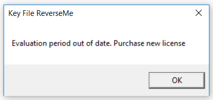

## CrackMe #11

[https://crackinglessons.com/crackme-11/](https://crackinglessons.com/crackme-11/)

This CrackMe is packed with UPX 3.91 packer. Your task is to :

1. Unpack it and then patch the unpacked file, or,
2. Create a loader for it

After unzipping you will find two files:

1. `CrackMe11-packed.exe`
2. `CrackMe11-unpacked.exe`

Use file 1 to practice **unpacking & loader**.
File 2 is just for you to compare to see what is the difference like between a packed and unpacked file.

[crackme11.zip](crackme11.zip)

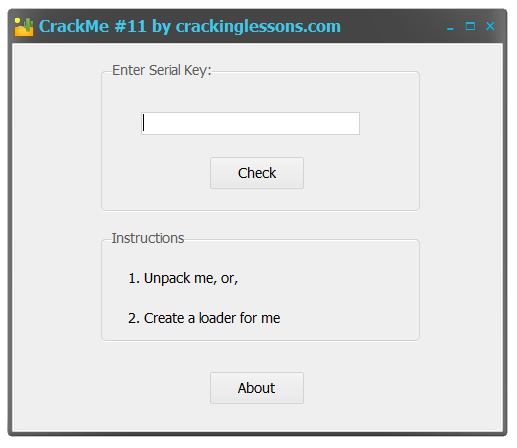

## CrackMe #12

[https://crackinglessons.com/crackme-12/](https://crackinglessons.com/crackme-12/)

This CrackMe has Anti-Debugging features. If you open it with a debugger and then run,
it will detect the debugger and exit.
Your task is to bypass the anti-debugging feature, so that the program
will continue to run and show the window below:

[crackMe12.zip](crackMe12.zip)

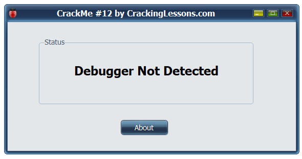

## CrackMe #13

[https://crackinglessons.com/crackme-13/](https://crackinglessons.com/crackme-13/)

This CrackMe combines three features:

1. Packing
2. Anti-Debugging
3. Software Serial Key Requirement

Your task is to:

1. Unpack it, or Create a Loader for it
2. Defeat the Anti-Debugging protection
3. Crack the Serial Key, or, Patch it

[crackMe13-packed.zip](crackMe13-packed.zip)

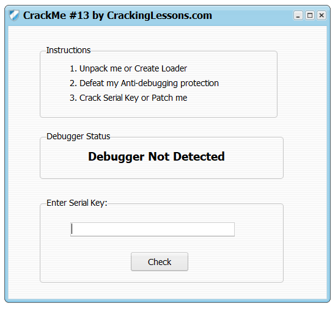

## CrackMe #14

[https://crackinglessons.com/crackme-14/](https://crackinglessons.com/crackme-14/)

This CrackMe asks for your firstname and then generates a Serial Key based on your firstname.

1. Create a Keygen that will be able to generate any Serial Key based on your firstname.
2. To solve this challenge, you may create a self-keygen or, write a separate keygen.

[crackMe14.zip](crackMe14.zip)

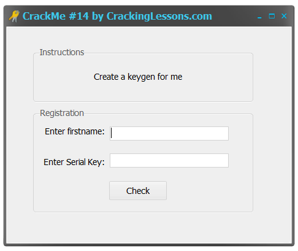

## CrackMe #15

[https://crackinglessons.com/crackme-15/](https://crackinglessons.com/crackme-15/)

Coming soon. It will be a cracking challenge. If you can solve it, you can claim a mystery prize.

## CrackMe #16

[https://crackinglessons.com/crackme-16/](https://crackinglessons.com/crackme-16/)

This crackme is created with Visual Basic 5/6 which is prior to the .NET framework.
Some programs out there are still written in it.
So here's your opportunity to crack such a program.
It is a mod of one of Lena's VB programs.
Note that this crackme is compiled to native format.
The p-code format will be covered in another crackme.

1. Get rid of the Nag screen which pops-up before the above window shows.
2. Crack the Regcode.

After unzipping, you will find 2 files:

- `CrackMe16.exe`
- `Msvbvm50.dll`

Double click on `CrackMe16.exe` to run.
The second file: `Msvbvm50.dll` is a run-time library needed by `CrackMe16.exe`

[crackMe16.zip](crackMe16.zip)

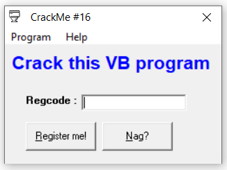

## CrackMe #17

[https://crackinglessons.com/crackme-17/](https://crackinglessons.com/crackme-17/)

This crackme is written in Visual Basic 6 and compiled as a p-code executable.

The objectives of this crackme are:

1. patch the file so that no matter what name or serial key you enter, it will become registered
2. create a keygen for it

Upon unzipping the file, you will find 3 files:

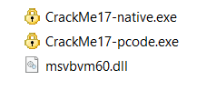

`CrackMe17-native.exe` is compiled in native format whilst `CrackMe17-pcode.exe`
is compiled in p-code format.
`msvbvm60.dll` is the library file needed by both CrackMe's in order to run.
Make sure that it is in the same folder as the CrackMe's.

[crackMe17.zip](crackMe17.zip)

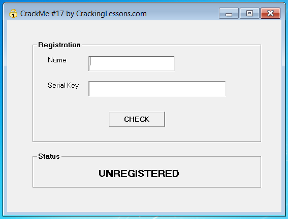

## CrackMe #18

[https://crackinglessons.com/crackme-18/](https://crackinglessons.com/crackme-18/)

This crackme is written in C# and is a .NET framework executable.

1. Patch it to always succeed no matter what name and serial key you enter.
2. Do serial fishing to extract the serial key based on a given name of your choice.
3. Create a keygen

- [crackMe18.zip](crackMe18.zip)
- [confused-CrackMe18.zip](confused-CrackMe18.zip)

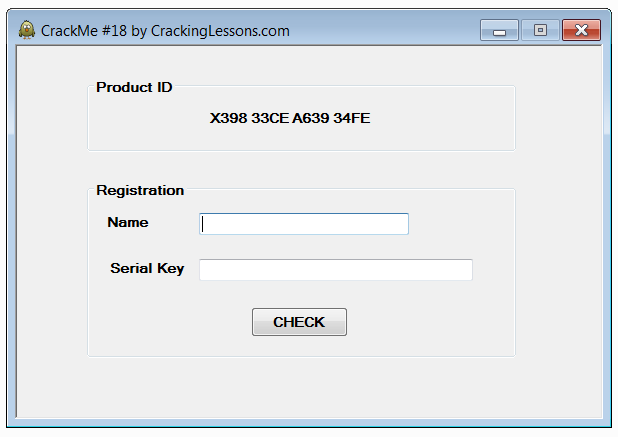

## Mexican CrackMe

[https://crackinglessons.com/mexican-crackme/](https://crackinglessons.com/mexican-crackme/)

This is your first CrackMe and it is called Mexican.
It was written by evilprogrammer and first published on `crackmes.one`
It is a command line crackme and is a good start for newbies.
Later in the course we will learn how to crack gui-based crackmes.

When the program is run, it will straight away show the bad message “try harder”.
Your task is to crack it to show the flag (password) instead of showing the bad message.

[01-mexican.zip](01-mexican.zip)

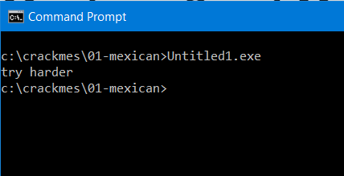

## CrackMe #19

[https://crackinglessons.com/crackme-19/](https://crackinglessons.com/crackme-19/)

This crackme comes in 2 files. The `crackme19.exe` is the main file and
there is also a DLL called `CrackmeLibrary.dll`.
The objective of this crackme is to practise patching the DLL instead of the
`crackme19.exe` file.

[crackMe19.zip](crackMe19.zip)

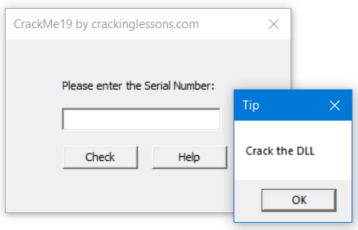

## CrackMe #20

[https://crackinglessons.com/crackme-20/](https://crackinglessons.com/crackme-20/)

A crackme with multi-threads for you to practice cracking. The objectives are:

1. Patch the thread that checks for the correct serial number
2. Do serial fishing for the serial number

[crackMe20.zip](crackMe20.zip)

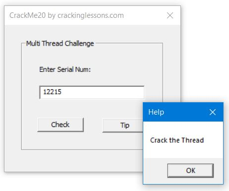

## Easy Peasy by whitecr0w

[https://crackinglessons.com/easy-peasy-by-whitecr0w/](https://crackinglessons.com/easy-peasy-by-whitecr0w/)

This crackme is written by whitecr0w and originally published in `crackmes.one`

It is a command line program. When run, it asks for Username. If you key in the correct username, it asks for Password. It is a 64 bit program. Although it is an easy crackme, the reason I chose this is because I like to demonstrate the use of x64dbg for cracking 64-bit program and also to demonstrate the use of the Graph tool for static analysis.

[easyPeasy.zip](easyPeasy.zip)

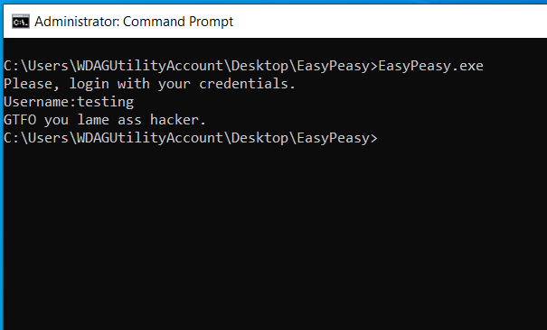
