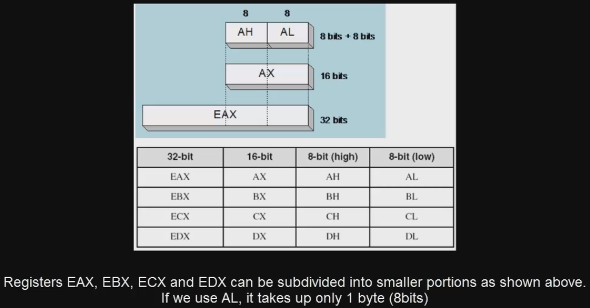
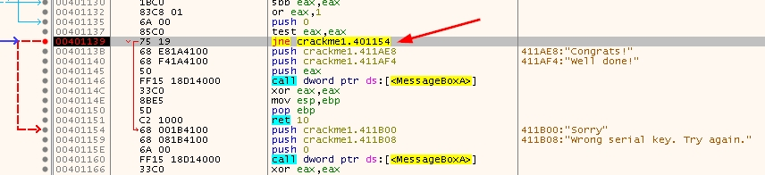
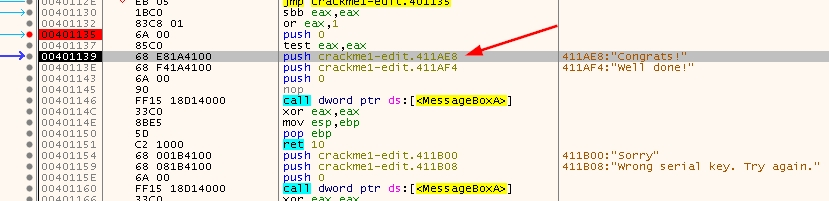
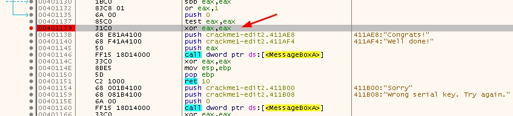

# Windows GUI Programs

## 2-4. Взлом `CrackMe1.exe`

Файл, который будет ломаться, здесь - [crackMe1.zip](../challenges/crackMe1.zip)

[Описание](../challenges/description.md)

Задание:

- Найти валидный серийный номер внутри файла
- Сделать так, чтобы валидным был любой вводимый текст

### Анализ PE файлов при помощи утилиты "Detect It Easy"

Для первичного анализа файла используется утилита `DIE` (Detect It Easy)

Подробнее см. в [02_x64dbg_debugger/4.3. Утилита `DIE` (Detect It Easy)](../02_x64dbg_debugger/x64dbg_debugger.md)

```text
Адрес EntryPoint программы = EntryPoint + ImageBase = 0x000013cf + 0x00400000 = 0x004013cf
```

Именно адрес `0x004013cf` является входной точкой программы `CrackMe1.exe`.
На этом адресе происходит останов при запуске программы в xdbg по F9 (run).

### Первичная настройка x32dbg/x64dbg

- Выключить TLS Callbacks
- В Ignored Exceptions добавить значение `0x00000000 - 0xFFFFFFFF`

Подробнее см. в [02_x64dbg_debugger/5. Debugger Stepping Basics/Setting Preferences. Предварительная настройка x32dbg/x64dbg)](../02_x64dbg_debugger/x64dbg_debugger.md)

## 5. Setting breakpoints on strings. Поиск по строке

На примере оконного приложения `CrackMe1.exe`

Последовательность шагов:

- Открываем файл в x32dbg/x64dbg
- Search for strings for bad message
- Put BP (breakpoint) on bad message
- Search for where serial key is being compared
- Put BP on the comparison instruction
- Extract the Serial Key

Под "bad message" понимается сообщение об ошибке, когда введено неправильное значение и т.п.

### Search for strings for bad message

Узнаем из неуспешного запуска сообщение об ошибке.

Запускаем программу в x32dbg/x64dbg -> `Run` (F9)

ПКМ -> Search For -> Current Module -> String references

Можем искать по подстроке в `Search:`

Подробнее см. в [02_x64dbg_debugger/7.2. Setting Breakpoints on Strings/Setting Preferences/2 Способ поиска строк, для больших программ)](../02_x64dbg_debugger/x64dbg_debugger.md)

Находим строку вида: "Wrong serial key. Try again", переходим по адресу этой строки.

### Search for where serial key is being compared

Пропускаем установку breakpoint на bad message. Видим чуть выше success message.

А еще выше видим инструкцию условного перехода `JNE`, которая выбирает какое сообщение будет показано.

 `JNE` - это Jump Not Equal, см. в [01_assembly_language/14.42-45. Intro to JUMPS/`JNZ` (Jump Not Zero) / `JNE` (Jump Not Equal)](../01_assembly_language/assembly_language.md)

Ставим breakpoint на `JNE`.

Выше идет сравнение значений в регистре, а еще выше чтение сообщения из поля ввода текста:

```asm
call dword ptr ds:[<&GetDlgItemTextA>]          // чтение ввода, ставим breakpoint сюда
...
lea eax, dword ptr ss:[ebp-30]                  // в eax появляется введенное значение
...
инструкции mov, cmp, jne
```

В ecx видна строка со значением, с которым производится сравнение eax.
В ecx содержится валидное слово.

Если это валидное слово ввести в окно `CrackMe1.exe`, то будет получено сообщение "Well done!"

## 6. Windows API functions

Windows API Functions = win32 API

Описания win32 функций смотреть на MSDN. Например для `MessageBox`:

[MSDN - MessageBox](https://learn.microsoft.com/ru-ru/windows/win32/api/winuser/nf-winuser-messagebox)

Или для функции `GetDlgItemTextA`:

[MSDN - GetDlgItemTextA](https://learn.microsoft.com/ru-ru/windows/win32/api/winuser/nf-winuser-getdlgitemtexta)

(Извлекает заголовок или текст, связанный с элементом управления в диалоговом окне.)

### 6.1. `MessageBox`

```asm
push 0                                  // [ Button Type ]
push "Sorry!"                           // [ Caption ]
push "Wrong serial key. Try again!"     // [ Text ]
push 0                                  // [ Parent Window ]
call MessageBox
```

Функция `MessageBox` - отображает модальное диалоговое окно, содержащее
системный значок, набор кнопок и краткое сообщение для конкретного приложения,
например сведения о состоянии или ошибке. Окно сообщения возвращает
целочисленное значение, указывающее, какую кнопку нажал пользователь.

Перед вызовом функции с параметрами все параметры
сначала помещаются в стек (инструкция 'PUSH'), а потом вызывается сама функция.

`MessageBox` (в C++) вызывается с 4 параметрами:

```cpp
int MessageBox(
  [in, optional] HWND    hWnd,
  [in, optional] LPCTSTR lpText,
  [in, optional] LPCTSTR lpCaption,
  [in]           UINT    uType
);
```

## 7. Pushing parameters to the stack

The stack is reverse of the push, the stack grows from bottom up.

Все параметры передаются в стек в обратном поряжке. В случае с `MessageBox`,
начиная с 4 по 1, а потом вызывается сама функция.

```text
[--- Stack ---]
0
Wrong serial key. Try again!
Sorry
0
```

Более подробно про стек см. в [01_assembly_language](../01_assembly_language/assembly_language.md):

- 07.18. The stack. Операция `PUSH`
- 07.20 Pushing constants and strings to the stack
- 08.21. Funcions call (`CALL`)
- 08.22. Funcions call (`CALL`). Вызов функций с 2 параметрами (строка, строка)
- 08.23. Funcions call (`CALL`). Вызов функций с 2 параметрами (строка, число)
- 08.24. Funcions call (`CALL`). Вызов функций с 3 параметрами

## 8. Bypassing messages. Показ другого (нужного) сообщения

Для `CrackMe1.exe` помимо секретного слова надо еще модифицировать (patch) файл так, чтобы он
всегда показывал Congrats сообщение при вводе любого текста (см. [description.md](../challenges/description.md))

### 8.1. Поиск мест для patching файла

1. Ищем строку сообщения об ошибке через

ПКМ на окне -> Search for -> Current Module -> String references

Подробнее см. в [02_x64dbg_debugger/2 Способ поиска строк, для больших программ](../02_x64dbg_debugger/x64dbg_debugger.md)

2. Видим `JNE`, который указывает параметры и на вызов MessageBox с сообщением об ошибке.

Ставим на `JNE` BreakPoint.

3. В режиме отладки, находясь на `JNE` можно переключить jump на другую ветку, исправив флаг `ZF`.

Подробнее см. в [02_x64dbg_debugger/8. Reversing Jumps](../02_x64dbg_debugger/x64dbg_debugger.md)

К сожалению, в этом случае Congrats сообщение не будет показано (впрочем как и сообщение об ошибке)
из-за некорректной передачи параметров в стек перед вызовом MessageBox с поздравлениями:

```text
[--- Wrong parameter 1 --]
push 0                // Button type     Верно
push "Congrats!"      // Caption         Верно
push "Well done!"     // Text            Верно
push eax              // Parent Window   Неверно, в eax лежит FFFFFFFF (-1), и это передается в стек
call MessageBox       // Не вызывается из-за Parent Window
```

Правильные параметры, которые должны быть:

```text
push 0                // Button type
push "Congrats!"      // Caption
push "Well done!"     // Text
push 0                // Parent Window   В eax надо положить 0
call MessageBox       // Должно быть OK
```

### 8.2. Правки файла

1. Удаляем инструкцию `JNE`. Вместо нее добавляются 2 инструкции `NOP` (No Operation).

Как вставить `NOP` см. в [02_x64dbg_debugger/9.1. How to patch a program](../02_x64dbg_debugger/x64dbg_debugger.md)

2. В `eax` надо записать `0`, чтобы MessageBox можно было вызвать.

У нас 2 байта для новой инструкции.

НО, если в `EAX` поместить 0:

```asm
MOV eax, 0
```

Такая инструкция занимает 5 байт - нам не хватает места.

Решение, надо поместить 0 в младший регистр `AL`:

```asm
MOV al, 0
```

Такая инструкция уже занимает 2 байта - нам хватает места.

```text
EAX занимает 4 байта
AX  занимает 2 байта
AL  занимает 1 байт
FFFFFFFF     4 байта
```



3. Patch файл

Подробнее см. в [02_x64dbg_debugger/9.1. How to patch a program/Запомнить изменения в файле (Patching)](../02_x64dbg_debugger/x64dbg_debugger.md)

Будет всего 2 изменения.

Почему-то такой "финт" с AL срабатывает - цель достигнута.

P.S.: автор в 9 уроке признал, что это лажа. В 9 уроке рассматривается более элегантное решение.

### 8.3. Как модифицировал я

Считаю, что препод не правильно сделал изменения в файле.

Я переставил инструкции, чтобы они все уместились. И нормальный push добавил.

Было:



Снес 4 инструкции. 2 инструкции перенес просто выше и добавил `push 0`. Еще и свободное место осталось.

Стало:



Крякнутое приложение (моя версия) [CrackMe1-edit.zip](src/CrackMe1-edit.zip)

Или можно использовать серийник/пароль, выдернутый из файла [CrackMe1-serial.txt](src/CrackMe1-serial.txt)

## 9. Bypassing using xor assembly. Показ другого (нужного) сообщения. Второй способ

Второй способ слома `CrackMe1.exe` (см. [description.md](../challenges/description.md))
И этот способ действительно рабочий (в отличие от предложенного автором в 8 уроке).

Тоже удаляется инструкция `JNE`. Вместо нее вставляется:

```asm
xor eax, eax
```

Было:


Стало:



- Эта инструкция занимает 2 байта, которые как раз освободились после удаления `JNE`.
- Любое значение в `EAX` после такого `XOR` на самого себя становится `0x00000000`

Крякнутое приложение таким способом [CrackMe1-edit2.zip](src/CrackMe1-edit2.zip)

## 10. Breakpoints on Intermodular Calls. Поиск по вызовам функций

Ранее искали по строке. Здесь еще один способ поиска - по Intermodular Calls.

Запуск программы, останов на EntryPoint.

`ПКМ -> Search for -> Intermodular calls`

В окне "References" появятся все вызовы функций.

Внизу, в поле `Search:` можно отфильтровать по подстроке.

На вызовы функций прямо отсюда можно поставить breakpoint (`F2`).

## 11. Breakpoints from Call Stack. Поиск по истории Call Stack

Искали код по:

- Строке
- Intermodular Calls

Здесь описан еще способ. Запуск программы (опять на примере `CrackMe1.exe`) в x32dbg.

Выводим окно с сообщением об ошибке, но его не закрываем. В x32dbg нажимаем "Pause" (обязательно!)
и переходим в окно "Call Stack".

В окне "Call Stack" история стека с момента запуска `CrackMe1.exe` на выполнение.
Самые ранние записи внизу, самые свежие - вверху.

Начиная сверху, берем первую строку, относящуюся к `CrackMe1.exe` - `crackme1.Callback+D6`
(или что-то подобное).

`ПКМ по адресу From -> Follow From` или `Enter`.

Переходим на место последнего вызова функции (на строку после нее). Видим вызов уже знакомого
MessageBox с сообщением об ошибке.

## 12-13. Registration checks

Разбор файла `CrackMe2.exe` - его надо зарегистрировать на себя, не делая patch
(см. [description.md](../challenges/description.md))

Как всегда, предварительно анализируем его при помощи утилиты "Detect It Easy", находим (вычисляем)
Entry point. См. ранее `Анализ PE файлов при помощи утилиты "Detect It Easy"`

Если надо выполняем первичную настройку xdbg - см. ранее `Первичная настройка x32dbg/x64dbg`

## 14. Registration checks. Как происходит проверка регистрации

Запускаем файл на выполнение в `x32dbg` - Run или F9.

Останов на Entry point.

Начинаем пошагово выполнять программу (F8), пока не появится окно приложения. Это вызов
функции вида:

```asm
...
call <crackme2._WinMain@16>
...
```

Ставим на нее breakpoint (F2) и проваливаемся в нее - Step Into (F7).

Уже внутри вызова идем пошагово (F8), вызов функции создания пустого окна, затем
передача каких-то значений в стек (push), потом вызов функции создания файла:

```asm
...
call dword ptr ds:[<&ShowWindow>]
push 0
push 40000080
push 3
push 0
push 1
push 80000000
push crackme2.411B28      // 411B28:"keyfile.txt"
call dword ptr ds:[<&CreateFileA>]
...
```

Гуглим описание функции:

[msdn CreateFileA](https://learn.microsoft.com/en-us/windows/win32/api/fileapi/nf-fileapi-createfilea)

```cpp
HANDLE CreateFileA(
  [in]           LPCSTR                lpFileName,
  [in]           DWORD                 dwDesiredAccess,
  [in]           DWORD                 dwShareMode,
  [in, optional] LPSECURITY_ATTRIBUTES lpSecurityAttributes,
  [in]           DWORD                 dwCreationDisposition,
  [in]           DWORD                 dwFlagsAndAttributes,
  [in, optional] HANDLE                hTemplateFile
);
```

Возвращаемое значение функции:

```text
...
Return value

If the function succeeds, the return value is an open handle to the specified file,
device, named pipe, or mail slot.

If the function fails, the return value is INVALID_HANDLE_VALUE.
...
```

Call **возвращает** значение и **записывает** его в `EAX`

После вызова функции `CreateFileA` видим:

```asm
...
call dword ptr ds:[<&CreateFileA>]
mov esi, eax                        // запись в регистр esi значения eax
cmp esi, FFFFFFFF                   // сравнение
je crackme2.4010BC                  // условный переход
```

`JE` - jumps only if the `ZF` is set to **1** (i.e. the result of the last calculation is **zero**)

В x32dbg и x64dbg инструкция `JZ` может обозначаться как `JE` (Jump Equal).

Шагаем по F8, функция возвращает и пишет в `EAX` значение `FFFFFFFF` (т.е. -1 - ошибка).
Далее будет сравнение и выполнится jump.

## 15. Software registration. Регистрация программы

Создаем пустой файл `keyfile.txt` рядом с `crackme2.exe`.

Теперь crackme2.exe пишет что зарегистрирован на... <пустое место>

Если в файл добавить какую-то строку, то эта строка появится в этом сообщении.

Функция `CreateFileA` теперь возвращает указатель на файл `keyfile.txt`.
Далее передаются параметры в стек и вызывается функция
[msdn readfile](https://learn.microsoft.com/en-us/windows/win32/api/fileapi/nf-fileapi-readfile)

```cpp
BOOL ReadFile(
  [in]                HANDLE       hFile,
  [out]               LPVOID       lpBuffer,
  [in]                DWORD        nNumberOfBytesToRead,
  [out, optional]     LPDWORD      lpNumberOfBytesRead,
  [in, out, optional] LPOVERLAPPED lpOverlapped
);
```

В коде:

```asm
...
je crackme2.4010BC
push 0
push <crackme2.struct _OVERLAPPED ol>
push 1F
push <crackme2.char * ReadBuffer>         // 4142E4:"слово в файле keyfile.txt"
push esi                                  // здесь указатель на файл keyfile.txt
call dword ptr ds:[&ReadFileEx]
...
```

Из описания:

```text
[out] lpBuffer

A pointer to the buffer that receives the data read from a file or device.

This buffer must remain valid for the duration of the read operation. The caller must not use this buffer until the read operation is completed.
```

### Итог взлома файла `CrackMe2.exe`

Файл [keyfile.txt](src/keyfile.txt), который надо положить рядом с `CrackMe2.exe`

## 16-17. Removing Nag screens. Удаление всплывающих окон

Разбор файла `CrackMe3.exe` (см. [description.md](../challenges/description.md)):

- Надо удалить всплывающие окна на старте и на закрытии приложения
- В окне "About" самого приложения надо поменять его статус на "Registered"

Как всегда: `Файл -> DIE -> x32dbg`

### 17.1. Еще одна настройка  x32dbg/x64dbg

В Options -> Preferences -> Events:

- Выключить `System Breakpoint`

Ну и удостовериться, что выключен `TLS Callbacks`

#### Выключение System Breakpoint

Выключение `System Breakpoint` (Системной точки останова) в отладчике x32dbg/x64dbg означает, что
отладчик перестанет автоматически останавливать выполнение программы в самый первый момент её
загрузки в память.

Когда опция включена программа останавливается на этапе, когда управление находится внутри
системной библиотеки `ntdll.dll` (то есть до выполнения первой строчки кода самого приложения).

При выключении `System Breakpoint` программа не будет сразу "вставать на паузу" в системном коде.
Отладчик проскочит этот этап.

Если вы выключите `System Breakpoint`, но оставите включенной опцию `Entry Breakpoint`
(Точка останова на точке входа), x64dbg остановит программу непосредственно на первой инструкции её
собственного кода (функция `main` или `WinMain`).

## 18. Removing Nag screen 1. Удаление первого всплывающего окна

При открытии файла в x32dbg сразу идет его запуск на выполнение с остановом на Entry Point.

Можно долго жать на F8 пока не появится первое всплывающее окно, а можно нажать:

```text
Trace -> Animate Over (Ctrl+F8)
```

Программа сама начнет шагать с некоторой задержкой и остановится на появлении всплывающего окна.

Подробнее про "анимацию" можно посмотреть в
[01_assembly_language/16.54. Graph view Trace Animate and Principles of Jumps)](../01_assembly_language/assembly_language.md)

Ставим сюда break point и делаем Step Into (F7) в вызов этого окна.

После недолгого анализа видим, что появление всплывающего окна управляется
инструкцией:

```asm
...
00401029 jne crackme3.401044
...
00401039 call dword ptr ds:[<&MessageBoxA>]    // Показ 1 всплывающего окна
...
00401048 call dword ptr ds:[<&ShowWindow>]     // Основное окно
```

Условный переход `jne` управляется флагом `ZF`:

- если `ZF = 1`, `jne` не выполняется и вызывается MessageBox
- если `ZF = 0`, `jne` выполняется и вызывается ShowWindow

Одно из решений поменять `jne` на `jmp` - безусловный jump, который всегда будет
прыгать на `ShowWindow`.

Инструкция jne и jmp одна и та же по размеру (при редактировании проверка
размера инструкии - флаг Keep Size).

Так что меняем и патчим файл: [CrackMe3-nag1.zip](src/CrackMe3-nag1.zip)

## 19. Removing Nag screen 2. Удаление второго всплывающего окна

В x32dbg запускаем программу с отсутствующим nag 1. Закрываем ее.

Появляется второе всплывающее окно, но его не закрываем. В x32dbg нажимаем "Pause" (обязательно!)
и переходим в окно "Call Stack".

В окне "Call Stack" история стека с момента запуска `CrackMe3.exe` на выполнение.
Самые ранние записи внизу, самые свежие - вверху.

Начиная сверху, берем первую строку, относящуюся к `CrackMe3.exe` (или что-то подобное).

`ПКМ по адресу From -> Follow From` или `Enter`.

Переходим на место последнего вызова функции (на строку после нее). Видим вызов уже знакомого
`MessageBox`.

Избавиться от `MessageBox` - заменить ее на `NOP`, плюс обязательно надо заменить параметры,
которые передаются в `MessageBox` (push в стек) на `NOP`.

Так что меняем и патчим файл: [CrackMe3-nag1-nag2.zip](src/CrackMe3-nag1-nag2.zip)

## 20. Setting Registration Status. Установка статуса Registered

В x32dbg запускаем программу с отсутствующим nag 1 и nag 2.

Тыкаем на кнопку "About". Как и в предыдущем разделе через

```
Pause -> Call Stack -> Follow From
```

добираемся до вызова `MessageBoxA`. Видим что в коде 2 вызова MessageBox с разными сообщениями
и управляются они через `JE`:

```asm
...
cmp dword ptr ds:[<int isRegistered>], eax
je 4010FC
...
call dword ptr ds:[<&MessageBoxA>]      // Статус "REGISTERED"
...
call dword ptr ds:[<&MessageBoxA>]      // Статус "Unregistered"
```

`ZF = 1`, поэтому выплняется `je` на MessageBox с сообщением "Unregistered"

### Решение 1. Заменить `JE` на `NOP`

Было сделано в видео. Заменяем `JE` на 2 инструкции `NOP`.

Показывается окно с сообщением "REGISTERED"

Итоговый файл: [CrackMe3-final1.zip](src/CrackMe3-final1.zip)

### Решение 2. Поставить переменную isRegistered в 1

Мое решение (более правильное), je не будет срабатывать, т.к. инструкция `cmp` установит `ZF = 0`.

Строка из видео:

```asm
cmp dword ptr ds:[<int isRegistered>], eax
```

У меня выглядела как:

```asm
cmp dword ptr ds:[4142A0], eax
```

При запуске программы вместо кода для nag screen 1 в адрес 0x004142A0 записал byte равный 1:

```asm
mov byte ptr ds:[0x004142A0], 0b1
```

Хотя, наверно можно было записать так, ведь читается dword:

```asm
mov dword ptr ds:[0x004142A0], 0x00000001
```

В результате:

```asm
cmp dword ptr ds:[4142A0],eax       // eax = 0x00000000, ZF = 0
je 4010EC                           // не срабатывает и выполняется первый MessageBoxA
...
call dword ptr ds:[<&MessageBoxA>]      // Статус "REGISTERED"
...
call dword ptr ds:[<&MessageBoxA>]      // Статус "Unregistered"
```

Итоговый файл: [CrackMe3-final2.zip](src/CrackMe3-final2.zip)

## Как отследить обращения по адресу в памяти. Hardware Breakpoint

Чтобы отследить любые обращения к конкретному адресу памяти в x32dbg / x64dbg,
используются аппаратные точки останова (Hardware Breakpoints).

В отличие от обычных программных точек останова (F2), которые модифицируют код,
аппаратные отслеживают чтение и запись на уровне процессора.

Вот пошаговый алгоритм, как это сделать:

- 1. Найдите нужный адрес в окне Дампа (Dump). Если вы знаете адрес, нажмите `Ctrl+G` в окне Дампа
(вкладка внизу слева). Введите ваш адрес (например, `00403020`) и нажмите `Enter`.
Отладчик подсветит этот байт.

- 2. Установите аппаратную точку останова.
Кликните правой кнопкой мыши по подсвеченному адресу в Дампе.
В контекстном меню выберите `Breakpoint (Точка останова) -> Hardware, Access (Аппаратная, Доступ)`.

- 2.1. Режим **Access**. Отладчик сработает и остановит программу, если этот адрес будет и прочитан,
и изменен (записан). Это лучший выбор для поиска обращений.

- 2.2. Режим **Hardware, Write**. Сработает только тогда, когда программа пытается изменить значение
по этому адресу.

- 3. Выберите размер отслеживаемых данных. Процессор может следить за участком разной длины.
Выберите размер в зависимости от того, что там находится:

- Byte (1 байт) - если это одиночный флаг или символ
- Word (2 байта) - для коротких чисел
- Dword (4 байта) - для стандартных 32-битных указателей и чисел (самый частый выбор в x32dbg).
- Qword (8 байт) - для 64-битных значений (в x64dbg).

- 4. Запустите программу. Нажмите `F9 (Run)`. Как только какая-то инструкция в коде попытается
прочитать или перезаписать данные по этому адресу, программа мгновенно остановится, а отладчик
перенесет вас в окно CPU на строку, которая совершила это обращение.

### Важные ограничения

Лимит процессора. Вы можете установить одновременно не более 4 аппаратных точек останова
(это аппаратное ограничение архитектуры x86/x64).

Посмотреть активные можно на вкладке Breakpoints (F5).

### Альтернатива (Memory Breakpoint)

Если вам нужно отследить обращение не к конкретному числу, а к огромному диапазону памяти
(например, целой секции данных .data), вместо Hardware используйте `Breakpoint -> Memory, Access`.