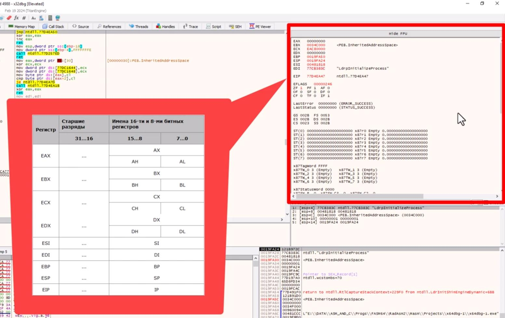
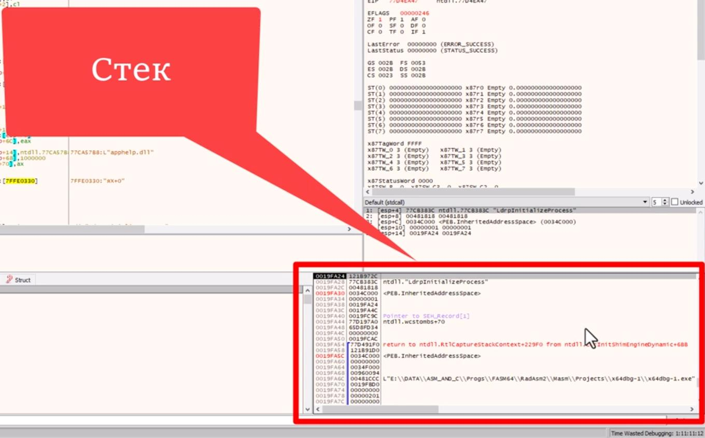
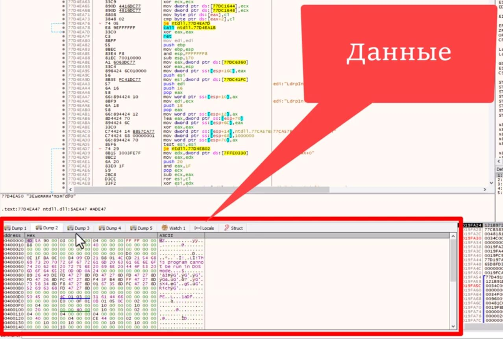
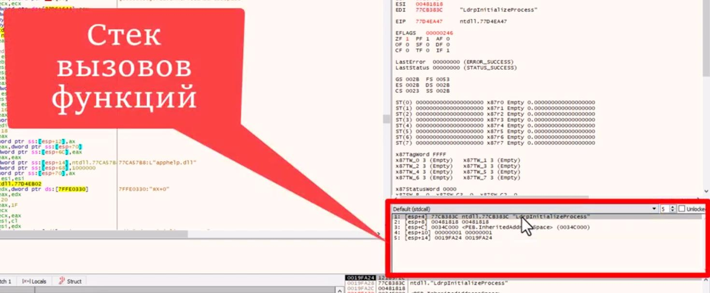

# YouTube. Видео по x64dbg

Источники:

- [First Steps.xdbg64](https://youtu.be/KfL2_UfvFTU?si=0Whqk6qTgIbrcFIJ)
- [x64Dbg Точка останова](https://youtu.be/ADn-ZThUds0?si=89g11zZ4h1AaX2wJ)

## Основные способности отладчиков

- Отслеживание обращений на запись, чтение и исполнение (установка breakpoint)

- Отслеживание загрузки dll и вызова из них определенных функций
(включая системные функции и функции пользовательских приложений)

- Отслеживание сообщений Windows, посылаееых приложнием окну (через break points на windows-сообщения)

- Контекстный поиск в памяти, ключая строковый поиск

## Интерфейс x64dbg

Вкладки:

- `CPU` - окно кода
  - Окно регистров (справа)
  - Стек
  - Окно с данными приложения
  - Окно стека вызова функций
  - Окно с информацией
  - Command line (самый низ окна)

Каждую из вкладок можно Deach и Delete.
Восстановить вкладку `View -> ...`
Если владка plugin, то она восстановится после перезагрузки отладчика.

### Вкладка CPU. Регистры CPU

32-х разрядное приложение

При первом приближении можно рассматривать их как глобальные переменные.
Для 64-х разрядного приложения регистры имеют другое обозначение.

Для совместимости со старым ПО и для удобства некоторые регистры разделены на нескольких частей.

Некоторые инструкции CPU могут работать только с некоторыми их них.

#### Спрятать/показать регистры FPU

`FPU` - регистры для работы с плавающей точкой

`ПКМ в окне регистры CPU -> Change view` -> Поменяется на Hide FPU/Show FPU

### Вкладка CPU. Стек

Первый вошел последний вышел

2 основные команды работы со стеком:

- `push`
- `pop`

### Вкладка CPU. Данные приложения

При запуске программы для нее в ОС выделяется вируальный блок памяти, куда копируется весь код и данные
программы. Здесь же находится стек, также ряд библиотек с функциями Win32 API.
К ядру ОС программа получает доступ через функции этих библиотек.

Т.о. каждая программа работает только в своем адресном пространстве.

### Вкладка CPU. Окно стека вызовов функций

Позволяет удобно отлеживать параметры вызванной функции.

### Вкладка CPU. Окно с информацией, command line

Отображение актуальной информации:

Самый низ - command line. Ручной ввод команд.

## Настройки x64dbg

- `Options -> Topmost` `(Ctrl+F5)` - Располагать окно отладчика поверх всех окон. Рекомендуется выключить.

- `Options -> Customize Menus` - Добавить свои пункты меню в ПКМ. Добавляются в `ПКМ -> More Commands`

- `Options -> Appearance` - настройки шрифтов, фонов

- `Favorities -> ...` - Добавить свои кнопки в отдельный toolbox главного окна.
Позволяет добавить запуск сторонних программ из этого toolbar.

### Настройки x64dbg. `Options -> Preferences`

- `Options -> Preferences` куча настроек

На вкладке `Events` рекомендуется оставить активным только пункт `Entry Breakpoint`.

`Entry Breakpoint` - точка начала исполнения отлаживаемой программы.

`TLS` (Thread Local Storage) - локальная память потока. Позволяет выполнять произвольный код
до передачи управления на Entry Point. Изначально задумывалась для разделения данных между
потоками приложения. В настоящее время `TLS` используется в антиотладочных методах, а также
в rootkit'ах, вирусах.

`System breakpoint` - системные действия по созданию или удалению потоков, загрузки модуля и т.п.
Выполняются перед запуском отлаживаемой программы.

На вкладке `GUI` можно включить `Show RVA addresses in graph view` - отображение адреса в блоках
графического отображения кода.

## Plugin для x64dbg

Можно найти на github.

Простые плагины состоят из 1 файла с расширением `.dp64` или `.dp32`.
Для их установки надо скопировать в директории, соответственно `x64/plugins` или `x32/plugins`.

Более сложные плагины - см. readme по их установке.

### Полезные plugins

- `APIBreak` - для упрощения работы с точками останова
- `CopyToAsm` - для преобразования выделенного блока в чистый ассемблерный код без дополнительной
информации.
- `PE Viewer` - работы со структурой заголовка PE (Portable Executable) файлов.
- `xAnalyzer` - вывод информации об API функциях как в OllyDbg
- `ScyllaHide` - анти анти-отладочный плагин

## Точки останова

Бывают

- **Аппаратные** - точки останова на уровне процессора
- **Программные** - точки останова на уровне программы

1. Пошаговое исполнение программы
2. Выполнение инсрукции по заданному адресу
3. Обращение к заданной ячейке памяти
4. И многое другое...

### Отладочные регистры (DR - Debug Register)

- `DR0 - DR3` - аппаратные точки останова. Всего 4 штуки.
- `DR6` - информация о состоянии отладчика, указывает какая из точек останова была активирована.
- `DR7` - управляет настройками отладочных регистров, включая активацию/деактивацию точек останова.

Флаг `TF` потерял актуальность (используется редко).

### Функционал отладки в Win32 API

Библиотеки с фунциями отладки:

- `Kernel32.dll`
- `Dbgeng.dll`
- `Dbghelp.dll`

### Что могут перехватывать точки останова

1. Исполняемый код
2. Вызов функций
3. Обращения к памяти и стеку (включая стек, который является частью памяти)
4. Сообщения Windows
5. Исключения Windows
6. Изменение регистра `ESP` (вершина стека)
7. Загрузка и выгрузка библиотек DLL

Программные:

- Условные
- Безусловные

Точки останова могут ставиться на:

- Доступ
- Запись
- Чтение
- Выполнение

## Установить Breakpoint

`ПКМ по области любого окна -> Breakpoint`

### В окне CPU

- Set conditional breakpoint (Shift+F2) - установить условную точку останова
- Toggle (F2) - включить/выключить breakpoint
- Set Hardware on Execution - поставить аппаратную точку останова на выполнение

В окне **CPU.Dump**, **CPU.Стек**:

- Можно поставить аппаратный breakpoint на: byte, word (2 байта), dword (4 байта)

Виды breakpoint:

- Access - все виды доступа
- Read - на чтение
- Write - на запись
- Execute - на выполнение
- Singleshoot - только раз (breakpoint сработает 1 раз и отключится)
- Restore on hit - breakpoint срабатывает до тех пор, пока его не отключат

В окне **CPU.Регистры**:

- Set Hardware Breakpoint on ESP - поставить breakpoint на регистр `ESP` (вершина стека)

### Вкладка Memory Map

Можно поставить Breakpoint на определенный учаток памяти

### Вкладка Call Stack

Поставить breakpoint на адреса вызванных до текущего момента функций

### Вкладка Handles

Сначала надо обновить информацию в окне: `ПКМ -> Refresh (F5)`

Здесь можно поставить breakpoint на сообщения Windows:

`ПКМ -> Message Breakpoint -> Выбор сообщения в выпадающем меню`

- Break on any window - отлавливать для всех окон
- Break on current window only - отлавливать только для текущего окна

- Toggle Breakpoint in Proc (F2) - breakpoint на процедуре обработки сообщений (каждое окно обрабатывает кучу сообщений)

### Вкладка Symbols

Поставить breakpoint на любую функцию отлаживаемого приложения или любой DLL.

### Вкладка Breakpoints

Здесь перечислены все установленные breakpoints с возможностью:

- корректировки
- активировать/деактивировать
- удалять
- переходить на адреса их установки
- и т.д.

**Дополнительно**:

- Add DLL breakpoint - поставить breakpoint на загрузку/выгрузку динамической библиотеки DLL
- Add exception breakpoint - breakpoint на исключение Windows (выбирается в выпадающем меню)
